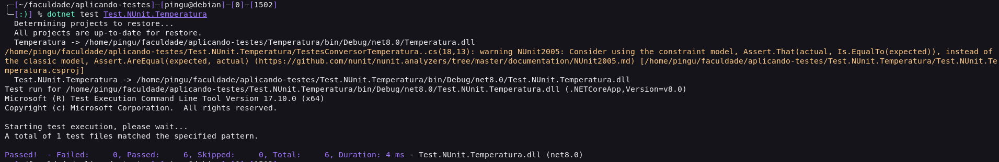
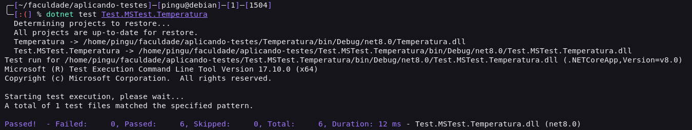

# Aplicando testes de unidade com .NET 

## Introdução

Esse repositorio tem como objetivo apresentar um exemplo de aplicação de testes de unidade com .NET. Para testar, foi utilizado os frameworks de testes XUnit, NUnit e MSTest.

## Pré-requisitos
É necessário ter o .NET Core SDK instalado na máquina. Para instalar, acesse o link: https://dotnet.microsoft.com/download

## XUnit
xUnit é uma estrutura de teste para C#, usada para escrever e executar testes automatizados . Ele é especialmente utilizado para testes unitários, que verificam partes isoladas do código, como métodos ou classes. No xUnit, os métodos de teste são identificados com atributos específicos, como `Fact` para testes sem parâmetros e `Theory` para testes parametrizados, usando `InlineData` para fornecer diferentes conjuntos de dados.

Para executar os testes em xUnit, basta acessar a pasta do projeto e executar o comando abaixo:

```
dotnet test Test.XUnit.Temperatura
```

Output:


## NUnit
NUnit também é uma estrutura de teste unitário para C#. Ele permite que os desenvolvedores verifiquem a funcionalidade de pequenas partes do código de forma isolada. Os testes no NUnit são definidos usando atributos específicos, como `Test` para identificar métodos de teste e `TestCase` para fornecer dados de teste múltiplos a um único método.

Para executar os testes em NUnit, basta acessar a pasta do projeto e executar o comando abaixo:

```
dotnet test Test.NUnit.Temperatura
```

Output:


## MSTest
O MSTest também é uma estrutura de teste unitário para C#. É usado para testar partes isoladas do código, como métodos ou classes. Os testes no MSTest são definidos usando atributos específicos, como `TestMethod` para identificar métodos de teste e `DataRow` para fornecer dados de teste múltiplos a um único método.

Para executar os testes em MSTest, basta acessar a pasta do projeto e executar o comando abaixo:

```
dotnet test Test.MSTest.Temperatura
```

Output:
