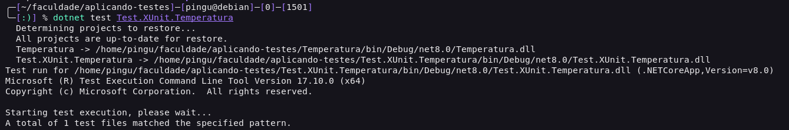

# Aplicando testes de unidade com .NET 

## Introdução

Esse repositorio tem como objetivo apresentar um exemplo de aplicação de testes de unidade com .NET. Para testar, foi utilizado os frameworks de testes XUnit, NUnit e MSTest.

## Pré-requisitos
É necessário ter o .NET Core SDK instalado na máquina. Para instalar, acesse o link: https://dotnet.microsoft.com/download

## XUnit
Para executar os testes em xUnit, basta acessar a pasta do projeto e executar o comando abaixo:

```
dotnet test Test.XUnit.Temperatura
```

Output:



## NUnit

Para executar os testes em NUnit, basta acessar a pasta do projeto e executar o comando abaixo:

```
dotnet test Test.NUnit.Temperatura
```

Output:


## MSTest
Para executar os testes em MSTest, basta acessar a pasta do projeto e executar o comando abaixo:

```
dotnet test Test.MSTest.Temperatura
```

Output:
